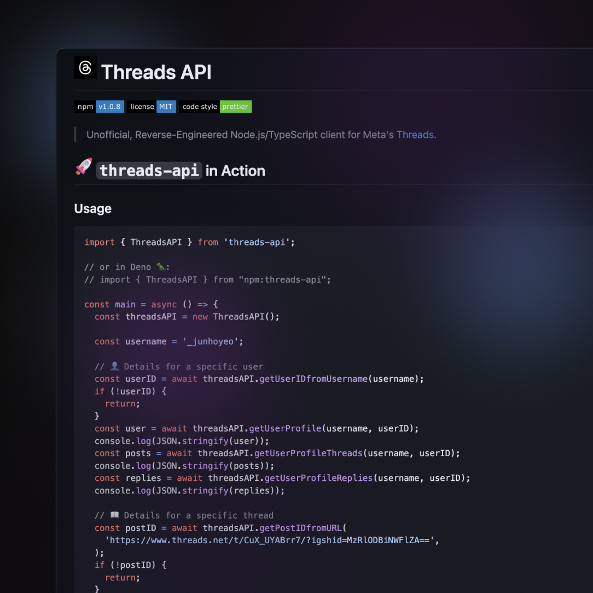

# [](https://github.com/junhoyeo) Threads API

[](https://www.npmjs.com/package/threads-api) [](https://github.com/junhoyeo/threads-api/blob/main/LICENSE) [](https://prettier.io)

> Unofficial, Reverse-Engineered Node.js/TypeScript client for Meta's [Threads](https://threads.net).

## [](https://github.com/junhoyeo) `threads-api` in Action

<p align="center">
  
</p>

<details>
<summary><h3>🚀 Usage (Read)</h3></summary>

```ts
import { ThreadsAPI } from 'threads-api';

// or in Deno 🦖:
// import ThreadsAPI from "npm:threads-api";

const main = async () => {
  const threadsAPI = new ThreadsAPI();

  const username = '_junhoyeo';

  // 👤 Details for a specific user
  const userID = await threadsAPI.getUserIDfromUsername(username);
  if (!userID) {
    return;
  }
  const user = await threadsAPI.getUserProfile(username, userID);
  console.log(JSON.stringify(user));
  const posts = await threadsAPI.getUserProfileThreads(username, userID);
  console.log(JSON.stringify(posts));
  const replies = await threadsAPI.getUserProfileReplies(username, userID);
  console.log(JSON.stringify(replies));

  // 📖 Details for a specific thread
  const postID = await threadsAPI.getPostIDfromURL(
    'https://www.threads.net/t/CuX_UYABrr7/?igshid=MzRlODBiNWFlZA==',
  );
  // or use `threadsAPI.getPostIDfromThreadID('CuX_UYABrr7')`
  if (!postID) {
    return;
  }
  const post = await threadsAPI.getThreads(postID);
  console.log(JSON.stringify(post.containing_thread));
  console.log(JSON.stringify(post.reply_threads));

  const likers = await threadsAPI.getThreadLikers(postID);
  console.log(JSON.stringify(likers));
};
main();
```

<details>
  <summary>
  <h3>📑 Outputs</h3>
  </summary>

<details>
  <summary>📑 Output — <code>threadsAPI.getUserIDfromUsername</code></summary>

```text
5438123050
```

</details>

<details>
  <summary>📑 Output — <code>threadsAPI.getUserProfile</code></summary>

```json
{
  "is_private": false,
  "profile_pic_url": "https://scontent.cdninstagram.com/v/t51.2885-19/358202847_614947594069692_3487562382200036996_n.jpg?stp=dst-jpg_s150x150&_nc_ht=scontent.cdninstagram.com&_nc_cat=100&_nc_ohc=tpgN_Gl7Ss8AX_KPF0P&edm=APs17CUBAAAA&ccb=7-5&oh=00_AfAdlFpCfjPKz_GZvgLRQEm5POc65Aj1nl_TmSUZjTidFg&oe=64ABED68&_nc_sid=10d13b",
  "username": "_junhoyeo",
  "hd_profile_pic_versions": [
    {
      "height": 320,
      "url": "https://scontent.cdninstagram.com/v/t51.2885-19/358202847_614947594069692_3487562382200036996_n.jpg?stp=dst-jpg_s320x320&_nc_ht=scontent.cdninstagram.com&_nc_cat=100&_nc_ohc=tpgN_Gl7Ss8AX_KPF0P&edm=APs17CUBAAAA&ccb=7-5&oh=00_AfDQn4L2KTPaqJWwWWisoBQUG_KjT2ZCNaI9i37utmmFTQ&oe=64ABED68&_nc_sid=10d13b",
      "width": 320
    },
    {
      "height": 640,
      "url": "https://scontent.cdninstagram.com/v/t51.2885-19/358202847_614947594069692_3487562382200036996_n.jpg?stp=dst-jpg_s640x640&_nc_ht=scontent.cdninstagram.com&_nc_cat=100&_nc_ohc=tpgN_Gl7Ss8AX_KPF0P&edm=APs17CUBAAAA&ccb=7-5&oh=00_AfCP-zT9v9Sn4qunRW13slzgCTfIdoCSRoR9_Z6CyvAshw&oe=64ABED68&_nc_sid=10d13b",
      "width": 640
    }
  ],
  "is_verified": false,
  "biography": "🐰🏴‍☠️ generalist hacker, designer, dreamer",
  "biography_with_entities": null,
  "follower_count": 124,
  "profile_context_facepile_users": null,
  "bio_links": [{ "url": "https://junho.io/about" }],
  "pk": "5438123050",
  "full_name": "Junho Yeo 🫧",
  "id": null
}
```

</details>

<details>
  <summary>📑 Output — <code>threadsAPI.getUserProfileThreads</code></summary>

```json
[
  {
    "thread_items": [
      {
        "post": {
          "user": {
            "profile_pic_url": "https://scontent.cdninstagram.com/v/t51.2885-19/358202847_614947594069692_3487562382200036996_n.jpg?stp=dst-jpg_s150x150&_nc_ht=scontent.cdninstagram.com&_nc_cat=100&_nc_ohc=tpgN_Gl7Ss8AX-xbV4J&edm=APs17CUBAAAA&ccb=7-5&oh=00_AfBiGFAmE-Sowhutr5D_oPhVQ2xo-bE4BkMkn6sTKOKCgA&oe=64ABED68&_nc_sid=10d13b",
            "username": "_junhoyeo",
            "id": null,
            "is_verified": false,
            "pk": "5438123050"
          },
          "image_versions2": {
            "candidates": [
              {
                "height": 480,
                "url": "http://static.cdninstagram.com/rsrc.php/null.jpg",
                "width": 480,
                "__typename": "XDTImageCandidate"
              },
              {
                "height": 320,
                "url": "http://static.cdninstagram.com/rsrc.php/null.jpg",
                "width": 320,
                "__typename": "XDTImageCandidate"
              },
              {
                "height": 240,
                "url": "http://static.cdninstagram.com/rsrc.php/null.jpg",
                "width": 240,
                "__typename": "XDTImageCandidate"
              },
              {
                "height": 150,
                "url": "http://static.cdninstagram.com/rsrc.php/null.jpg",
                "width": 150,
                "__typename": "XDTImageCandidate"
              },
              {
                "height": 612,
                "url": "http://static.cdninstagram.com/rsrc.php/null.jpg",
                "width": 612,
                "__typename": "XDTImageCandidate"
              }
            ]
          },
          "original_width": 612,
          "original_height": 612,
          "video_versions": [],
          "carousel_media": null,
          "carousel_media_count": null,
          "pk": "3140761422133509618",
          "has_audio": null,
          "text_post_app_info": {
            "link_preview_attachment": null,
            "share_info": {
              "quoted_post": null,
              "reposted_post": {
                "pk": "3140641520020994048",
                "user": {
                  "profile_pic_url": "https://scontent.cdninstagram.com/v/t51.2885-19/357840283_601898142066410_8236921479226938783_n.jpg?stp=dst-jpg_s150x150&_nc_ht=scontent.cdninstagram.com&_nc_cat=102&_nc_ohc=QMqnnEoXdxsAX_sWsoP&edm=APs17CUBAAAA&ccb=7-5&oh=00_AfAgubnBVBX57Wxc7n6Og-0GGksxFgn2O5Gv2aABIbwXoQ&oe=64AC793A&_nc_sid=10d13b",
                  "username": "michaelshillingburg",
                  "id": null,
                  "is_verified": false,
                  "pk": "12117536"
                },
                "image_versions2": { "candidates": [] },
                "original_width": 612,
                "original_height": 612,
                "video_versions": [],
                "carousel_media": null,
                "carousel_media_count": null,
                "has_audio": null,
                "text_post_app_info": {
                  "link_preview_attachment": null,
                  "share_info": { "quoted_post": null },
                  "reply_to_author": null,
                  "is_post_unavailable": false
                },
                "caption": {
                  "text": "I'm sorry why are all the interaction buttons so close together do I look like I have needles for fingers"
                },
                "like_count": 9,
                "taken_at": 1688613666,
                "code": "CuVzNKXsbgA",
                "id": "3140641520020994048_12117536"
              }
            },
            "reply_to_author": null,
            "is_post_unavailable": false
          },
          "caption": null,
          "taken_at": 1688627959,
          "like_count": 0,
          "code": "CuWOd96hL3y",
          "media_overlay_info": null,
          "id": "3140761422133509618_5438123050"
        },
        "line_type": "line",
        "view_replies_cta_string": "1 reply",
        "reply_facepile_users": [
          {
            "__typename": "XDTUserDict",
            "id": null,
            "profile_pic_url": "https://scontent.cdninstagram.com/v/t51.2885-19/357897142_1484591815626242_8599120059151338067_n.jpg?stp=dst-jpg_s150x150&_nc_ht=scontent.cdninstagram.com&_nc_cat=102&_nc_ohc=RA3w5L-0xqAAX-LHueV&edm=APs17CUBAAAA&ccb=7-5&oh=00_AfAN3_4MWAvUCV43q86z5E-BkyMY5jwKwm1xV59gUo6CcA&oe=64AC7635&_nc_sid=10d13b"
          }
        ],
        "should_show_replies_cta": true,
        "__typename": "XDTThreadItem"
      }
    ],
    "id": "3140761422133509618"
  },
  {
    "thread_items": [
      {
        "post": {
          "user": {
            "profile_pic_url": "https://scontent.cdninstagram.com/v/t51.2885-19/358202847_614947594069692_3487562382200036996_n.jpg?stp=dst-jpg_s150x150&_nc_ht=scontent.cdninstagram.com&_nc_cat=100&_nc_ohc=tpgN_Gl7Ss8AX-xbV4J&edm=APs17CUBAAAA&ccb=7-5&oh=00_AfBiGFAmE-Sowhutr5D_oPhVQ2xo-bE4BkMkn6sTKOKCgA&oe=64ABED68&_nc_sid=10d13b",
            "username": "_junhoyeo",
            "id": null,
            "is_verified": false,
            "pk": "5438123050"
          },
          "image_versions2": {
            "candidates": [
              {
                "height": 480,
                "url": "http://static.cdninstagram.com/rsrc.php/null.jpg",
                "width": 480,
                "__typename": "XDTImageCandidate"
              },
              {
                "height": 320,
                "url": "http://static.cdninstagram.com/rsrc.php/null.jpg",
                "width": 320,
                "__typename": "XDTImageCandidate"
              },
              {
                "height": 240,
                "url": "http://static.cdninstagram.com/rsrc.php/null.jpg",
                "width": 240,
                "__typename": "XDTImageCandidate"
              },
              {
                "height": 150,
                "url": "http://static.cdninstagram.com/rsrc.php/null.jpg",
                "width": 150,
                "__typename": "XDTImageCandidate"
              },
              {
                "height": 612,
                "url": "http://static.cdninstagram.com/rsrc.php/null.jpg",
                "width": 612,
                "__typename": "XDTImageCandidate"
              }
            ]
          },
          "original_width": 612,
          "original_height": 612,
          "video_versions": [],
          "carousel_media": null,
          "carousel_media_count": null,
          "pk": "3140573486419221952",
          "has_audio": null,
          "text_post_app_info": {
            "link_preview_attachment": null,
            "share_info": {
              "quoted_post": null,
              "reposted_post": {
                "pk": "3140570843146170251",
                "user": {
                  "profile_pic_url": "https://scontent.cdninstagram.com/v/t51.2885-19/358110565_1464606827702362_5765656138118155279_n.jpg?stp=dst-jpg_s150x150&_nc_ht=scontent.cdninstagram.com&_nc_cat=110&_nc_ohc=7nM_57lclegAX_39zlm&edm=APs17CUBAAAA&ccb=7-5&oh=00_AfCmQl2U8oEDfU_qAi4gk7oN7FZn2Sn0sJldyrglQqQRdA&oe=64AB8477&_nc_sid=10d13b",
                  "username": "ruido.98",
                  "id": null,
                  "is_verified": false,
                  "pk": "11391473334"
                },
                "image_versions2": {
                  "candidates": [
                    {
                      "height": 616,
                      "url": "https://scontent.cdninstagram.com/v/t51.2885-15/357877120_126579060472932_1459391482917729292_n.jpg?stp=dst-jpg_e15&_nc_ht=scontent.cdninstagram.com&_nc_cat=100&_nc_ohc=vrfJ3RfiLKQAX9ythpj&edm=APs17CUBAAAA&ccb=7-5&oh=00_AfDGQd4r1MCSwMTUbb8n_TodpeDvel6Py-mOOurxizLDdA&oe=64A806D7&_nc_sid=10d13b",
                      "width": 640,
                      "__typename": "XDTImageCandidate"
                    },
                    {
                      "height": 462,
                      "url": "https://scontent.cdninstagram.com/v/t51.2885-15/357877120_126579060472932_1459391482917729292_n.jpg?stp=dst-jpg_e15_s480x480&_nc_ht=scontent.cdninstagram.com&_nc_cat=100&_nc_ohc=vrfJ3RfiLKQAX9ythpj&edm=APs17CUBAAAA&ccb=7-5&oh=00_AfBDyrvb6a4yKFFIq4PeWEFxUdnGSgnV98K-LUqsCv79KA&oe=64A806D7&_nc_sid=10d13b",
                      "width": 480,
                      "__typename": "XDTImageCandidate"
                    },
                    {
                      "height": 308,
                      "url": "https://scontent.cdninstagram.com/v/t51.2885-15/357877120_126579060472932_1459391482917729292_n.jpg?stp=dst-jpg_e15_s320x320&_nc_ht=scontent.cdninstagram.com&_nc_cat=100&_nc_ohc=vrfJ3RfiLKQAX9ythpj&edm=APs17CUBAAAA&ccb=7-5&oh=00_AfCSHpxdQDQqOcvh9BIBsB6BOo-P7PpkW6rBevVbb5G2VA&oe=64A806D7&_nc_sid=10d13b",
                      "width": 320,
                      "__typename": "XDTImageCandidate"
                    },
                    {
                      "height": 231,
                      "url": "https://scontent.cdninstagram.com/v/t51.2885-15/357877120_126579060472932_1459391482917729292_n.jpg?stp=dst-jpg_e15_s240x240&_nc_ht=scontent.cdninstagram.com&_nc_cat=100&_nc_ohc=vrfJ3RfiLKQAX9ythpj&edm=APs17CUBAAAA&ccb=7-5&oh=00_AfCfE7CpaYqBFSN7SDq6J76Q5viPdZqwvsO_MCrCMEFCyg&oe=64A806D7&_nc_sid=10d13b",
                      "width": 240,
                      "__typename": "XDTImageCandidate"
                    },
                    {
                      "height": 144,
                      "url": "https://scontent.cdninstagram.com/v/t51.2885-15/357877120_126579060472932_1459391482917729292_n.jpg?stp=dst-jpg_e15_s150x150&_nc_ht=scontent.cdninstagram.com&_nc_cat=100&_nc_ohc=vrfJ3RfiLKQAX9ythpj&edm=APs17CUBAAAA&ccb=7-5&oh=00_AfB3VaYLhjnd2d8--9jABYcwioHsoskYFkac6NqQJZUpeQ&oe=64A806D7&_nc_sid=10d13b",
                      "width": 150,
                      "__typename": "XDTImageCandidate"
                    },
                    {
                      "height": 480,
                      "url": "https://scontent.cdninstagram.com/v/t51.2885-15/357877120_126579060472932_1459391482917729292_n.jpg?stp=c12.0.616.616a_dst-jpg_e15_s480x480&_nc_ht=scontent.cdninstagram.com&_nc_cat=100&_nc_ohc=vrfJ3RfiLKQAX9ythpj&edm=APs17CUBAAAA&ccb=7-5&oh=00_AfDpd3zNq2lzTbJNwhW4xalFOmEg7mE15U3_a956SKzw1w&oe=64A806D7&_nc_sid=10d13b",
                      "width": 480,
                      "__typename": "XDTImageCandidate"
                    },
                    {
                      "height": 320,
                      "url": "https://scontent.cdninstagram.com/v/t51.2885-15/357877120_126579060472932_1459391482917729292_n.jpg?stp=c12.0.616.616a_dst-jpg_e15_s320x320&_nc_ht=scontent.cdninstagram.com&_nc_cat=100&_nc_ohc=vrfJ3RfiLKQAX9ythpj&edm=APs17CUBAAAA&ccb=7-5&oh=00_AfDWJkgF5RGW2rQMmUCMEntsJS0gtTLKvrvyMgzsATOoJw&oe=64A806D7&_nc_sid=10d13b",
                      "width": 320,
                      "__typename": "XDTImageCandidate"
                    },
                    {
                      "height": 240,
                      "url": "https://scontent.cdninstagram.com/v/t51.2885-15/357877120_126579060472932_1459391482917729292_n.jpg?stp=c12.0.616.616a_dst-jpg_e15_s240x240&_nc_ht=scontent.cdninstagram.com&_nc_cat=100&_nc_ohc=vrfJ3RfiLKQAX9ythpj&edm=APs17CUBAAAA&ccb=7-5&oh=00_AfA61eQQX0JMNV5_Kojyhh5QyohvHABv2Gx7xQfOx8kcMg&oe=64A806D7&_nc_sid=10d13b",
                      "width": 240,
                      "__typename": "XDTImageCandidate"
                    },
                    {
                      "height": 150,
                      "url": "https://scontent.cdninstagram.com/v/t51.2885-15/357877120_126579060472932_1459391482917729292_n.jpg?stp=c12.0.616.616a_dst-jpg_e15_s150x150&_nc_ht=scontent.cdninstagram.com&_nc_cat=100&_nc_ohc=vrfJ3RfiLKQAX9ythpj&edm=APs17CUBAAAA&ccb=7-5&oh=00_AfD4UxiymM4Iw5E6Sc6bsXSH2S-lap_BRxJ0KDV3M4Z8Rw&oe=64A806D7&_nc_sid=10d13b",
                      "width": 150,
                      "__typename": "XDTImageCandidate"
                    }
                  ]
                },
                "original_width": 640,
                "original_height": 616,
                "video_versions": [
                  {
                    "type": 101,
                    "url": "https://scontent.cdninstagram.com/v/t50.2886-16/358387842_266467495971409_8715164333553902633_n.mp4?_nc_ht=scontent.cdninstagram.com&_nc_cat=101&_nc_ohc=_kxmxhph1pEAX8pe5ki&edm=APs17CUBAAAA&ccb=7-5&oh=00_AfCiOSh3s_6LMrErbPA-vRZeSB3rkmHfQXF8zWe10xhLIA&oe=64A7FACB&_nc_sid=10d13b",
                    "__typename": "XDTVideoVersion"
                  },
                  {
                    "type": 103,
                    "url": "https://scontent.cdninstagram.com/v/t50.2886-16/358387842_266467495971409_8715164333553902633_n.mp4?_nc_ht=scontent.cdninstagram.com&_nc_cat=101&_nc_ohc=_kxmxhph1pEAX8pe5ki&edm=APs17CUBAAAA&ccb=7-5&oh=00_AfCiOSh3s_6LMrErbPA-vRZeSB3rkmHfQXF8zWe10xhLIA&oe=64A7FACB&_nc_sid=10d13b",
                    "__typename": "XDTVideoVersion"
                  },
                  {
                    "type": 102,
                    "url": "https://scontent.cdninstagram.com/v/t50.2886-16/358387842_266467495971409_8715164333553902633_n.mp4?_nc_ht=scontent.cdninstagram.com&_nc_cat=101&_nc_ohc=_kxmxhph1pEAX8pe5ki&edm=APs17CUBAAAA&ccb=7-5&oh=00_AfCiOSh3s_6LMrErbPA-vRZeSB3rkmHfQXF8zWe10xhLIA&oe=64A7FACB&_nc_sid=10d13b",
                    "__typename": "XDTVideoVersion"
                  }
                ],
                "carousel_media": null,
                "carousel_media_count": null,
                "has_audio": true,
                "text_post_app_info": {
                  "link_preview_attachment": null,
                  "share_info": { "quoted_post": null },
                  "reply_to_author": null,
                  "is_post_unavailable": false
                },
                "caption": { "text": "loading animation is so good" },
                "like_count": 181,
                "taken_at": 1688605248,
                "code": "CuVjIrZrS-L",
                "id": "3140570843146170251_11391473334"
              }
            },
            "reply_to_author": null,
            "is_post_unavailable": false
          },
          "caption": null,
          "taken_at": 1688605555,
          "like_count": 0,
          "code": "CuVjvJJBx3A",
          "media_overlay_info": null,
          "id": "3140573486419221952_5438123050"
        },
        "line_type": "line",
        "view_replies_cta_string": "9 replies",
        "reply_facepile_users": [
          {
            "__typename": "XDTUserDict",
            "id": null,
            "profile_pic_url": "https://scontent.cdninstagram.com/v/t51.2885-19/357825063_1268453057088075_5855869692915646330_n.jpg?stp=dst-jpg_s150x150&_nc_ht=scontent.cdninstagram.com&_nc_cat=103&_nc_ohc=DV6_6YlrvuIAX8exWdZ&edm=APs17CUBAAAA&ccb=7-5&oh=00_AfBtpV4qYinVjVTPiFnDCzHEbyvn5kolK0qD1XxHASquQg&oe=64AB53D9&_nc_sid=10d13b"
          },
          {
            "__typename": "XDTUserDict",
            "id": null,
            "profile_pic_url": "https://scontent.cdninstagram.com/v/t51.2885-19/358000024_6335610049887857_4656093213491359876_n.jpg?stp=dst-jpg_s150x150&_nc_ht=scontent.cdninstagram.com&_nc_cat=105&_nc_ohc=8D_To92SNLYAX_cpE-8&edm=APs17CUBAAAA&ccb=7-5&oh=00_AfDgDLhSMmYkBuac1D4nKnfr6oe2IN9w6GhnxXJTC9B5RQ&oe=64ABCFAF&_nc_sid=10d13b"
          },
          {
            "__typename": "XDTUserDict",
            "id": null,
            "profile_pic_url": "https://scontent.cdninstagram.com/v/t51.2885-19/358062917_1006284143836105_5216368917785207505_n.jpg?stp=dst-jpg_s150x150&_nc_ht=scontent.cdninstagram.com&_nc_cat=101&_nc_ohc=MnqgCbU5FJUAX9WVTLG&edm=APs17CUBAAAA&ccb=7-5&oh=00_AfC971EDNjs7q0da-MjJMMURvu7ubjwqaT7XlduwNpB24Q&oe=64AB7A8B&_nc_sid=10d13b"
          }
        ],
        "should_show_replies_cta": true,
        "__typename": "XDTThreadItem"
      }
    ],
    "id": "3140573486419221952"
  },
  {
    "thread_items": [
      {
        "post": {
          "user": {
            "profile_pic_url": "https://scontent.cdninstagram.com/v/t51.2885-19/358202847_614947594069692_3487562382200036996_n.jpg?stp=dst-jpg_s150x150&_nc_ht=scontent.cdninstagram.com&_nc_cat=100&_nc_ohc=tpgN_Gl7Ss8AX-xbV4J&edm=APs17CUBAAAA&ccb=7-5&oh=00_AfBiGFAmE-Sowhutr5D_oPhVQ2xo-bE4BkMkn6sTKOKCgA&oe=64ABED68&_nc_sid=10d13b",
            "username": "_junhoyeo",
            "id": null,
            "is_verified": false,
            "pk": "5438123050"
          },
          "image_versions2": { "candidates": [] },
          "original_width": 612,
          "original_height": 612,
          "video_versions": [],
          "carousel_media": null,
          "carousel_media_count": null,
          "pk": "3140573360413755314",
          "has_audio": null,
          "text_post_app_info": {
            "link_preview_attachment": null,
            "share_info": { "quoted_post": null, "reposted_post": null },
            "reply_to_author": null,
            "is_post_unavailable": false
          },
          "caption": { "text": "댓글달다가 자꾸 조아요 누르게 댐;" },
          "taken_at": 1688605540,
          "like_count": 9,
          "code": "CuVjtTyhEey",
          "media_overlay_info": null,
          "id": "3140573360413755314_5438123050"
        },
        "line_type": "line",
        "view_replies_cta_string": "4 replies",
        "reply_facepile_users": [
          {
            "__typename": "XDTUserDict",
            "id": null,
            "profile_pic_url": "https://scontent.cdninstagram.com/v/t51.2885-19/358193361_265325182774836_7030905286266807347_n.jpg?stp=dst-jpg_s150x150&_nc_ht=scontent.cdninstagram.com&_nc_cat=100&_nc_ohc=AyT5dvEtMYEAX8QnPlh&edm=APs17CUBAAAA&ccb=7-5&oh=00_AfA77sX5R0O4uKcLNSH9hD8wf4hKdxImIChuP7_BYAbJew&oe=64AC4397&_nc_sid=10d13b"
          },
          {
            "__typename": "XDTUserDict",
            "id": null,
            "profile_pic_url": "https://scontent.cdninstagram.com/v/t51.2885-19/357813133_2463706223791861_7631880548305895633_n.jpg?stp=dst-jpg_s150x150&_nc_ht=scontent.cdninstagram.com&_nc_cat=101&_nc_ohc=-Dhoeq61aIMAX8AqhMN&edm=APs17CUBAAAA&ccb=7-5&oh=00_AfA62eWC36zyyzo-5bKdDBVnl8V35YxBrqotMap8sSJwxw&oe=64AB8EE4&_nc_sid=10d13b"
          },
          {
            "__typename": "XDTUserDict",
            "id": null,
            "profile_pic_url": "https://scontent.cdninstagram.com/v/t51.2885-19/358161614_176128428624396_5409241973976278275_n.jpg?stp=dst-jpg_s150x150&_nc_ht=scontent.cdninstagram.com&_nc_cat=100&_nc_ohc=8PTU16j-_9cAX-dG0Fd&edm=APs17CUBAAAA&ccb=7-5&oh=00_AfDtCpSG5xvZas_QNd5dzSsfU1HPRz1Ojlu0IAujAdqrZw&oe=64AB696A&_nc_sid=10d13b"
          }
        ],
        "should_show_replies_cta": true,
        "__typename": "XDTThreadItem"
      }
    ],
    "id": "3140573360413755314"
  },
  {
    "thread_items": [
      {
        "post": {
          "user": {
            "profile_pic_url": "https://scontent.cdninstagram.com/v/t51.2885-19/358202847_614947594069692_3487562382200036996_n.jpg?stp=dst-jpg_s150x150&_nc_ht=scontent.cdninstagram.com&_nc_cat=100&_nc_ohc=tpgN_Gl7Ss8AX-xbV4J&edm=APs17CUBAAAA&ccb=7-5&oh=00_AfBiGFAmE-Sowhutr5D_oPhVQ2xo-bE4BkMkn6sTKOKCgA&oe=64ABED68&_nc_sid=10d13b",
            "username": "_junhoyeo",
            "id": null,
            "is_verified": false,
            "pk": "5438123050"
          },
          "image_versions2": { "candidates": [] },
          "original_width": 612,
          "original_height": 612,
          "video_versions": [],
          "carousel_media": null,
          "carousel_media_count": null,
          "pk": "3140570097706735401",
          "has_audio": null,
          "text_post_app_info": {
            "link_preview_attachment": null,
            "share_info": { "quoted_post": null, "reposted_post": null },
            "reply_to_author": null,
            "is_post_unavailable": false
          },
          "caption": { "text": "Really like those cute profile bubbles 💯" },
          "taken_at": 1688605151,
          "like_count": 4,
          "code": "CuVi91KBhcp",
          "media_overlay_info": null,
          "id": "3140570097706735401_5438123050"
        },
        "line_type": "none",
        "view_replies_cta_string": null,
        "reply_facepile_users": [],
        "should_show_replies_cta": false,
        "__typename": "XDTThreadItem"
      }
    ],
    "id": "3140570097706735401"
  },
  {
    "thread_items": [
      {
        "post": {
          "user": {
            "profile_pic_url": "https://scontent.cdninstagram.com/v/t51.2885-19/358202847_614947594069692_3487562382200036996_n.jpg?stp=dst-jpg_s150x150&_nc_ht=scontent.cdninstagram.com&_nc_cat=100&_nc_ohc=tpgN_Gl7Ss8AX-xbV4J&edm=APs17CUBAAAA&ccb=7-5&oh=00_AfBiGFAmE-Sowhutr5D_oPhVQ2xo-bE4BkMkn6sTKOKCgA&oe=64ABED68&_nc_sid=10d13b",
            "username": "_junhoyeo",
            "id": null,
            "is_verified": false,
            "pk": "5438123050"
          },
          "image_versions2": { "candidates": [] },
          "original_width": 612,
          "original_height": 612,
          "video_versions": [],
          "carousel_media": null,
          "carousel_media_count": null,
          "pk": "3140565796708146241",
          "has_audio": null,
          "text_post_app_info": {
            "link_preview_attachment": null,
            "share_info": { "quoted_post": null, "reposted_post": null },
            "reply_to_author": null,
            "is_post_unavailable": false
          },
          "caption": { "text": "gm threads 👻" },
          "taken_at": 1688604639,
          "like_count": 7,
          "code": "CuVh_Pih9xB",
          "media_overlay_info": null,
          "id": "3140565796708146241_5438123050"
        },
        "line_type": "none",
        "view_replies_cta_string": null,
        "reply_facepile_users": [],
        "should_show_replies_cta": false,
        "__typename": "XDTThreadItem"
      }
    ],
    "id": "3140565796708146241"
  }
]
```

</details>

<details>
  <summary>📑 Output — <code>threadsAPI.getUserProfileReplies</code></summary>

Same as the output of `threadsAPI.getUserProfileThreads` but `thread_items.length` is `2`, with the latter as the reply. 😉

</details>

</details>

</details>

### 🚀 Usage (Write)

### New API (from v1.2.0)

#### ✨ Text Threads

```ts
import { ThreadsAPI } from 'threads-api';

const main = async () => {
  const threadsAPI = new ThreadsAPI({
    username: '_junhoyeo', // Your username
    password: 'PASSWORD', // Your password
  });

  await threadsAPI.publish({
    text: '🤖 Hello World',
  });
};

main();
```

<p align="center">
  <a href="https://www.threads.net/t/CucsGvZBs9q">
    
  </a>
</p>

> **💡 TIP**: Use the [`url` field in `ThreadsAPIPublishOptions` to render Link Attachments(link previews).](https://github.com/junhoyeo/threads-api#-threads-with-link-attachment)

#### ✨ Threads with Image

```ts
await threadsAPI.publish({
  text: '🤖 Threads with Image',
  image: 'https://github.com/junhoyeo/threads-api/raw/main/.github/cover.jpg',
});
```

#### ✨ Threads with Link Attachment

```ts
await threadsAPI.publish({
  text: '🤖 Threads with Link Attachment',
  url: 'https://github.com/junhoyeo/threads-api',
});
```

#### ✨ Reply to Other Threads

```ts
const parentURL = 'https://www.threads.net/t/CugF-EjhQ3r';
const parentPostID = await threadsAPI.getPostIDfromURL(parentURL); // or use `getPostIDfromThreadID`

await threadsAPI.publish({
  text: '🤖 Beep',
  link: 'https://github.com/junhoyeo/threads-api',
  parentPostID: parentPostID,
});
```

<p align="center">
  <a href="https://www.threads.net/t/CugF-EjhQ3r">
    
  </a>
</p>

<details>
  <summary>
    <h3>Old API (Deprecated, Still works for backwards compatibility)</h3>
  </summary>

```ts
import { ThreadsAPI } from 'threads-api';

const main = async () => {
  const threadsAPI = new ThreadsAPI({
    username: 'jamel.hammoud', // Your username
    password: 'PASSWORD', // Your password
  });

  await threadsAPI.publish('🤖 Hello World');
};

main();
```

You can also provide custom `deviceID` (Default is `android-${(Math.random() * 1e24).toString(36)}`).

```ts
const deviceID = `android-${(Math.random() * 1e24).toString(36)}`;

const threadsAPI = new ThreadsAPI({
  username: 'jamel.hammoud',
  password: 'PASSWORD',
  deviceID,
});
```

</details>

## [](https://github.com/junhoyeo) Installation

```bash
yarn add threads-api
# or with npm
npm install threads-api
# or with pnpm
pnpm install threads-api
```

```typescript
// or in Deno 🦖
import ThreadsAPI from 'npm:threads-api';

const threadsAPI = new ThreadsAPI.ThreadsAPI({});
```

## [](https://github.com/junhoyeo) Roadmap

- [x] ✅ Read public data
  - [x] ✅ Fetch UserID(`314216`) via username(`zuck`)
  - [x] ✅ Read User Profile Info
  - [x] ✅ Read list of User Threads
  - [x] ✅ Read list of User Repiles
  - [x] ✅ Fetch PostID(`3140957200974444958`) via PostID(`CuW6-7KyXme`) or PostURL(`https://www.threads.net/t/CuW6-7KyXme`)
  - [x] ✅ Read Threads via PostID
  - [x] ✅ Read Likers in Thread via PostID
  - [ ] 🚧 Read User Followers
  - [ ] 🚧 Read User Followings
- [ ] 🚧 Read private data
- [x] ✅ Write data (i.e. write automated Threads)
  - [x] ✅ Create new Thread with text
    - [x] ✅ Make link previews to get shown
  - [x] ✅ Create new Thread with a single image
  - [ ] 🚧 Create new Thread with a multiple images
  - [x] ✅ Reply to existing Thread
- [x] 🏴‍☠️ Restructure project as an monorepo
  - [x] 🏴‍☠ Add Demo App with Next.js
    - [x] Use components in 🏴‍☠️ [junhoyeo/react-threads](https://github.com/junhoyeo/react-threads)
    - [ ] Make it better
  - [x] 🏴‍☠️ Cool CLI App to run Threads in the Terminal

## [](https://github.com/junhoyeo) Projects made with `threads-api`

> Add yours by just opening an [pull request](https://github.com/junhoyeo/threads-api/pulls)!

### [🏴‍☠️ `react-threads`: Embed Static Threads in your React/Next.js application.](https://github.com/junhoyeo/react-threads)

[](https://www.npmjs.com/package/react-threads) [](https://github.com/junhoyeo/react-threads/blob/main/license) [](https://prettier.io) [](https://github.com/junhoyeo/react-threads)

> Embed Static Threads in your React/Next.js application. UI components for Meta's Threads. _Powered by **junhoyeo/threads-api**._

[](https://react-threads.vercel.app)

#### Demo

> **Warning**<br/>
> Vercel Deployment is currently sometimes unstable. 🏴‍☠️

[](https://react-threads.vercel.app/CuUoEcbRFma)

<details>
  <summary>
  <h3>🏴‍☠️ <code>threads-api</code> CLI (WIP)</code></h3>

To use the `threads-api` command line interface, run the following command:

  </summary>

```sh
$ npx threads-api --help
Usage: threads-api [command] [options]

Options:
  -v, --version                                                                   output the current version
  -h, --help                                                                      display help for command

Commands:
  help                                                                            display help for command
  getUserIDfromUsername|userid|uid|id <username>                                  det user ID from username
  getUserProfile|userprofile|uprof|up <username> <userId> [stringify]             get user profile
  getUserProfileThreads|uthreads|ut <username> <userId> [stringify]               get user profile threads
  getUserProfileReplies|userreplies|ureplies|ur <username> <userId> [stringify]   get user profile replies
  getPostIDfromURL|postid|pid|p <postURL>                                         get post ID from URL
  getThreads|threads|t <postId> [stringify]                                       get threads
  getThreadLikers|threadlikers|likers|l <postId> [stringify]                      get thread likers
```

</details>

### [👤 `threads-card`: Share your Threads profile easily](https://github.com/yssf-io/threads-card)

### [👤 `Strings`: Web-Frontend for Threads](https://github.com/Nainish-Rai/strings-web)

[](https://strings.vercel.app)

## License

<p align="center">
  <a href="https://github.com/junhoyeo">
    
  </a>
</p>

<p align="center">
  <strong>MIT © <a href="https://github.com/junhoyeo">Junho Yeo</a></strong>
</p>

If you find this project intriguing, **please consider starring it(⭐)** or following me on [GitHub](https://github.com/junhoyeo) (I wouldn't say [Threads](https://www.threads.net/@_junhoyeo)). I code 24/7 and ship mind-breaking things on a regular basis, so your support definitely won't be in vain.
